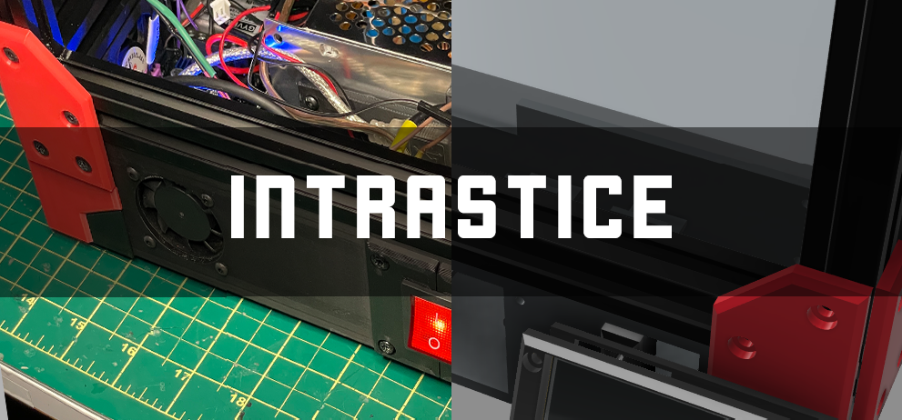
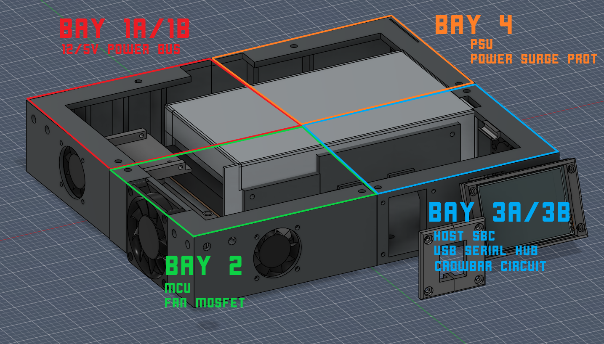
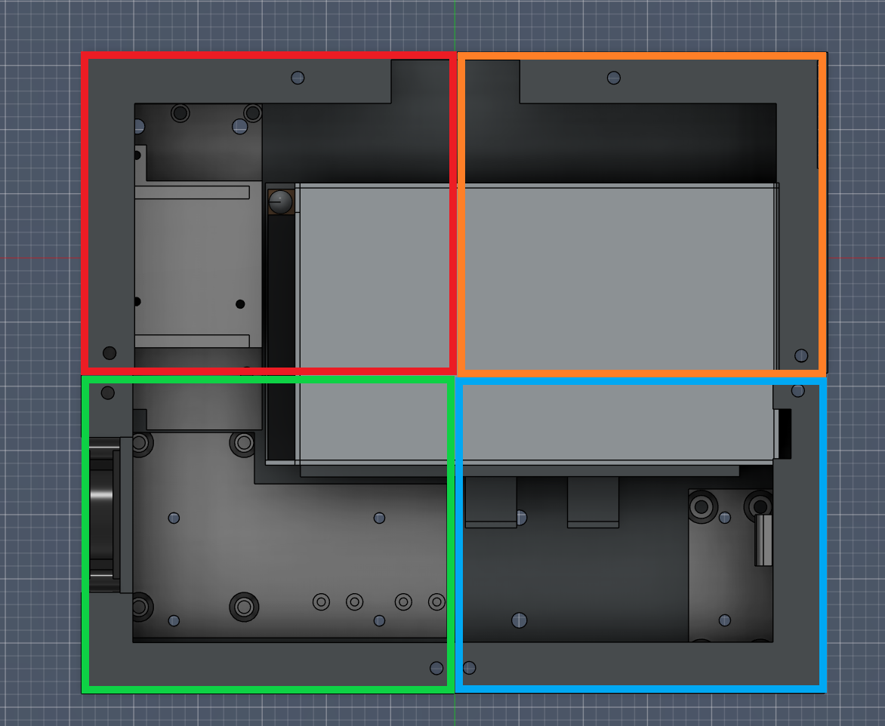
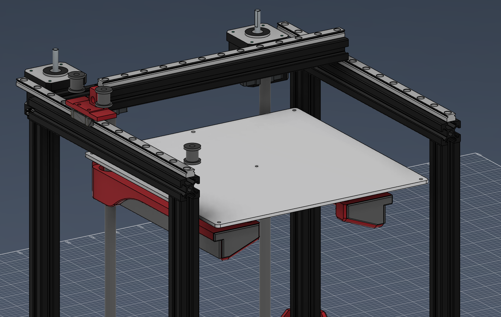

<h1 align="center">Intrastice - Extremely Compact 220mm HBot 3D Printer</h1>

  Complete repository for the modification of the Makerbot Replicator Plus (5th Gen)  

## Table of Contents

1.0 [Project Description](#project-description)

2.0 [Features](#features)

3.0 [Other Major Features](#other-major-features)

4.0 [Physical Design](#physical-design)

5.0 [Kinematic Design](#kinematic-design)

6.0 [Electronic Design](#electronic-design)

7.0 [Firmware](#firmware)

8.0 [Credits](#credits)

## Project Description
This project aims to 'upgrade' a stock MakerBot replicator plus, or also referred to as 5th gen, into a significantly more reliable and faster 3D printer at a low cost, using as many original parts as possible. 

I had recieved this printer for free myself, and after using it myself I can understand why it was given for free. Aside from being one of the most proprietary consumer 3D printers I've ever encountered, only supporting their own .makerbot sliced files for printing (which took a thousand years to finally get their program working), this printer had enough flaws to be a terrible design even at the time of its release; no heated bed, no electronics upgradability, unreliable non-standard extruder, no space for standard 1kg spools, the list goes on.

Four priorities were made for the design of this printer specifically,
1. Reliable
2. Low cost
3. Modular/Upgradable
4. Issues from my own predecessing 3D printer design, [Chimera iXY](https://github.com/Aetriq/ChimeraiXY)

## Features
- High-speed 3D printer with a build volume to physical footprint ratio of 0.3-0.35, making it a very compact 220mm^3 3D printer.
- ESP32-based CYD interface and ESPCAM for a fully custom closed-loop state machine-style Edge AI based nozzle clumping detection and monitoring. Check out the [latter project here](https://github.com/Aetriq/ESP32CAM-NozzleClumpingDetection), where development is continuing in parallel.
- Uses Mellow's Micro4 and Fly-ADXL345, both of which powered by the RP2040 microcontroller. It is to be determined where or not that this will run before every print.

### Other Major Features
- CPAP cooling
- E3D V6 + Titan Extruder, 50mm^3/s flow
- Sensorless Homing
- Enclosed (Final design)
- Nozzle failure detection + resolution
- Nozzle wiper
- Filament cutter design
- Input shaping (automated TBD)

## Physical Design
A more modular approach was proposed compared to my predecessor design. The electronics are split into 'bays' to organize each section. All electronics are housed in the bottom section under the frame.

## Kinematic Design
Here, we use an HBot dropped motor gantry to keep it as original to the replicator as possible but also to eliminate the need of buying more belts (since CoreXY requires around double the length). Racking has not been tested but brackets will be designed to mitigate this.

A cantilever Z axis was also used, identical to the replicator. The 220mm x 220mm bed has no issues with this so far. 

The MGN9H rails and blocks are also very heavy duty (replicator gantry was a couple kg. vs. the <1kg gantry made here) so any racking should not be significant enough to be an issue.

!!! DIAGRAM WORK IN PROGRESS, UPDATING SOON !!!

## Electronic Design
This is the current implemented electronic circuit.

Since this is a 24V system and the replicator is 12V, we include a 12V (LM2596) and 5V (GYVRM) power bus with a relevant crowbar circuit (initially a zener/tvs/fuse config, but a dedicated circuit to protect the SBC and MCUs).

!!! ALSO WORK IN PROGRESS, UPDATING SOON !!!

## Firmware
To be determined...

Only klipper supported, unfortunately Marlin cannot be supported for this project. As of writing this the RP2040 is still under development for MCU support and this project requires more advanced macros and features to remain compact and keep it universal for slicers.

## Credits
- Designs improved/derived from [ChimeraiXY by me](https://github.com/Aetriq/ChimeraiXY)
- Implements and contributes to the design of [ESP32CAM-NozzleClumpingDetection](https://github.com/Aetriq/ESP32CAM-NozzleClumpingDetection)
- [suchmememanyskill/CYD-Klipper](https://github.com/suchmememanyskill/CYD-Klipper) for CYD interface (modified)
- [3DMellow](https://3dmellow.com/)
- [ESP32-S MCU](https://www.espressif.com/en/products/socs/esp32S) by EspressIF
- [RP2040 MCU](https://pip-assets.raspberrypi.com/categories/814-rp2040/documents/RP-008371-DS-1-rp2040-datasheet.pdf) by Raspberry Pi Foundation
- [Klipper Firmware](https://www.klipper3d.org/)
- [Mainsail Interface](https://docs.mainsail.xyz/) 

## License
This project is licensed under the GNU General Public License v3.0 (GPL-3.0 ATTRIBUTION). You are free to share, modify, and build upon this work, provided that you give appropriate credit to the original author, include a copy of the license, and distribute any derivative works under the same license terms.